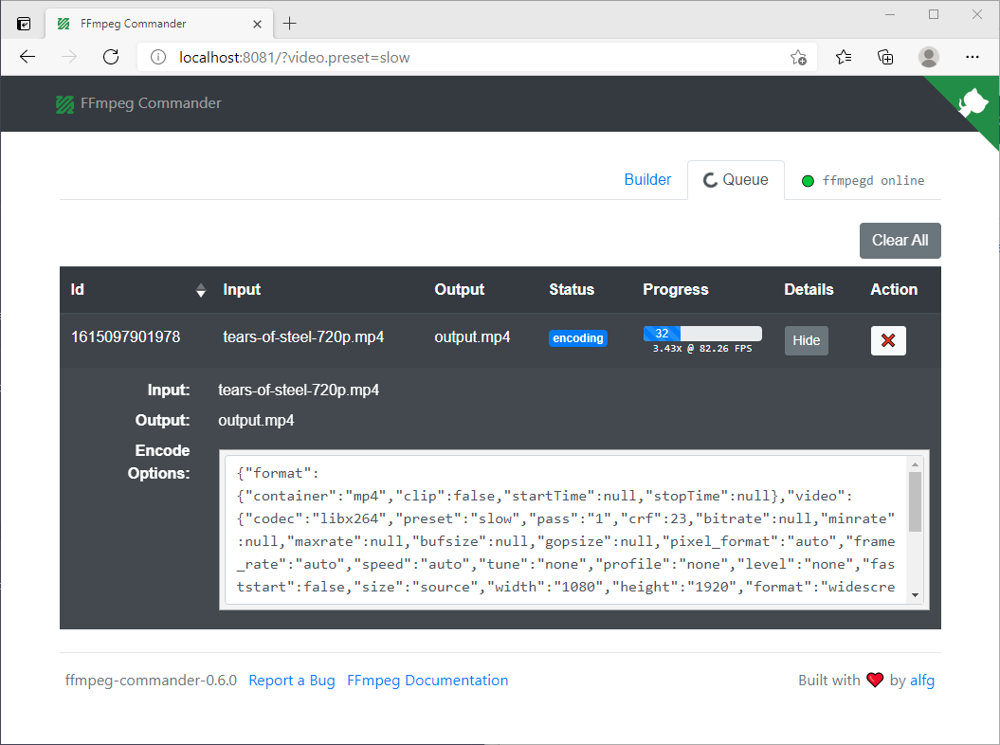

# `ffmpegd`
[FFmpeg](https://www.ffmpeg.org/) websocket server and API for [FFmpeg Commander](https://alfg.github.io/ffmpeg-commander).

**Currently a work-in-progress! Bugs and breaking changes are expected.*

[](https://godoc.org/github.com/alfg/ffmpegd)
[](https://goreportcard.com/report/github.com/alfg/ffmpegd)

[](https://hub.docker.com/r/alfg/ffmpegd/)
[](https://hub.docker.com/r/alfg/ffmpegd/builds/)

[](https://github.com/alfg/ffmpegd/actions/workflows/go.yml)
[](https://github.com/alfg/ffmpegd/actions/workflows/docker.yml)
[](https://github.com/alfg/ffmpegd/actions/workflows/release.yml)

## How It Works
`ffmpegd` connects [FFmpeg Commander](https://alfg.github.io/ffmpeg-commander) to [ffmpeg](https://www.ffmpeg.org/) by providing a websocket server to send encode tasks and receive realtime progress updates back to the browser. This allows using `ffmpeg-commander` as a GUI for `ffmpeg`.

The goal is to provide a simple interface for sending FFmpeg tasks from the browser (and other supported clients in the future) to your local machine.

See [Usage](#Usage) for more details.

```
          process              websocket
[ffmpeg] <-------> [ffmpegd] <-----------> [ffmpeg-commander]
```

## Install
### Go
```
$ go get -u github.com/alfg/ffmpegd
```

### Download
Release binaries for your platform at:
https://github.com/alfg/ffmpegd/releases

### Docker
A Docker image is available with [alfg/ffmpeg](https://github.com/alfg/docker-ffmpeg) build installed:

```
$ docker run -it -p 8080:8080 -v /tmp/:/home alfg/ffmpegd
```

Or via GitHub Container Registry:
```
$ docker run -it -p 8080:8080 -v /tmp/:/home ghcr.io/alfg/ffmpegd
```

Or using the `docker-compose` example:
```
$ docker-compose up ffmpegd
```

### Homebrew
TBD

## Usage
* [ffmpeg](https://www.ffmpeg.org/download.html) must be installed and available on your `$PATH`.
* Run `ffmpegd`:
```
$ ffmpegd
```

This wil start the websocket server in your current working directory and wait for a connection.

* Go to https://alfg.github.io/ffmpeg-commander/ in the browser
* Enable `ffmpegd` in Options.
* Once connected, you can start sending encode jobs to ffmpegd!

## Example
### `ffmpegd` with a job in progress from `ffmpeg-commander`
```
$ ffmpegd

███████╗███████╗███╗   ███╗██████╗ ███████╗ ██████╗ ██████╗
██╔════╝██╔════╝████╗ ████║██╔══██╗██╔════╝██╔════╝ ██╔══██╗
█████╗  █████╗  ██╔████╔██║██████╔╝█████╗  ██║  ███╗██║  ██║
██╔══╝  ██╔══╝  ██║╚██╔╝██║██╔═══╝ ██╔══╝  ██║   ██║██║  ██║
██║     ██║     ██║ ╚═╝ ██║██║     ███████╗╚██████╔╝██████╔╝
╚═╝     ╚═╝     ╚═╝     ╚═╝╚═╝     ╚══════╝ ╚═════╝ ╚═════╝
                                                      v0.0.8

[ffmpegd] - websocket server for ffmpeg-commander.

  Checking FFmpeg version....4.3.1
  Checking FFprobe version...4.3.1

  Server started on port :8080.
  - Go to https://alfg.github.io/ffmpeg-commander to connect!
  - ffmpegd must be enabled in ffmpeg-commander options!

Encoding... 6111 / 17620 (34.68%) 3.37x @ 80.77
```


## WebSocket Demo
See [demo](demo/) for a websocket client example.

## Develop
```
go build -v
./ffmpegd
```

#### Tests
```
go test ./...
```

## TODO
* Logging levels and output

## License
MIT
